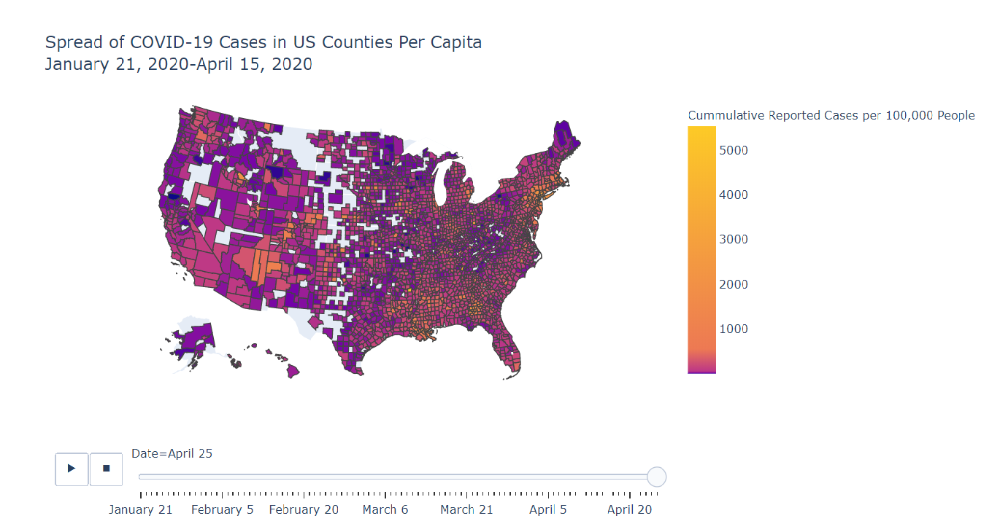

# Visualizing-COVID-19-Data

## Background

As the COVID-19 crisis continues to worsen all over the world, we need accurate information and efficient responses. Studying the data available is imperative to get there. However, we also want to know how to present our data in a way that is easy to navigate, comprehensive, and straightforward. In this study we explore ways to visualize COVID-19 data and therefore better understand the consequences of the pandemic on counties across the US. This study was conducted over Google Colab.

### Density of COVID-19 cases in the United States

## Data Sources

1. https://github.com/CSSEGISandData/COVID-19/tree/master/csse_covid_19_data/csse_covid_19_daily_reports
2. https://github.com/nytimes/covid-19-data/blob/master/us-counties.csv
3. https://raw.githubusercontent.com/plotly/datasets/master/geojson-counties-fips.json

## Conclusion

The bubble map and density heatmap both suggest that big cities are most affected, while areas that are sparsely populated are less affected. From looking at the animated Chloropleth map's changes over time, we notice that cases first start in the coasts at big cities then spread to other areas in the state and further inland. We note that some remote areas seem to have no cases but this may be because of the absence of data.

This data is helpful for decision making because it enables us to see which areas are most affected and therefore may need assistance (supplies, personnel, etc.) and are not ready to reopen. On the other hand, areas that have fewer sick people and are showing a decrease in the rate of new cases may be considered for loosened restrictions. To further study the impact of the pandemic, we can also make graphics pertaining to deaths to see if there are any areas that are particularly struggling, as this may be due to lack of healthcare and support and/or abnormalities with the virus such as different strains. For the latter, this information might be useful to scientists who are studying the evolution of the virus and how to stop it.
